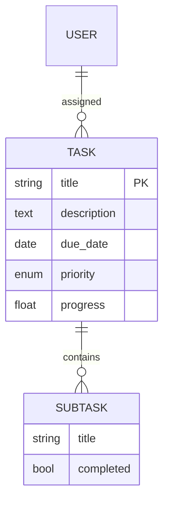

# PRD: Kanban 任務管理系統

## 1. 簡介/概述
提供團隊協作的看板式任務管理系統，支援工作項認領、進度追蹤與管理。解決遠端團隊任務可視化與責任分配問題。

## 2. 目標
1. 實現任務生命週期可視化（待辦→進行→審核→完成）
2. 降低任務分配溝通成本50%
3. 支援每月1000+工作項處理規模

## 3. 使用者故事
- 身為管理員，我要拆分複雜任務為子任務，以便分配給多個成員
- 身為成員，我要拖放認領任務到進行中欄位，以便開始工作
- 身為成員，我要上傳成果附件，以便提交任務審核
- 身為管理員，我要審核完成任務，以便關閉工作項

## 4. 功能需求
### 4.1 核心功能
1. 工作項管理
   - 創建/編輯工作項（標題、描述、負責人、截止日、優先級）
   - 支持標籤分類（最多3標籤/項）
   - 附件上傳（≤10MB）
2. 看板操作
   - 拖放改變任務狀態
   - 篩選（負責人/優先級/標籤）
   - 進度自動計算
3. 權限控制
   - 管理員：用戶管理+任務拆分+審核
   - 成員：認領任務+更新進度

### 4.2 工作流

## 5. 非目標（不在範圍內）
1. 行動端原生APP
2. 第三方支付整合
3. 即時聊天功能

## 6. 設計考量
- **UI布局**：三欄響應式設計
- **交互模式**：拖放優先
- **視覺標示**：
  - 優先級顏色：紅(高)/黃(中)/綠(低)
  - 逾期任務：閃爍警示圖標

## 7. 技術考量
### 7.1 架構

### 7.2 技術棧
- 前端：React + react-dnd
- 後端：Node.js/Express
- 數據庫：PostgreSQL

## 8. 成功指標
1. 任務平均週轉時間 ≤24小時
2. 成員每週主動認領任務 ≥5項
3. 逾期任務率 ≤10%

## 9. 待解問題
1. 是否整合日曆提醒功能？
2. 是否需要任務依賴關係管理？
