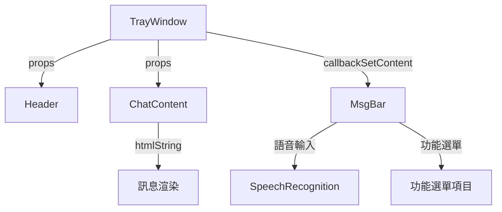
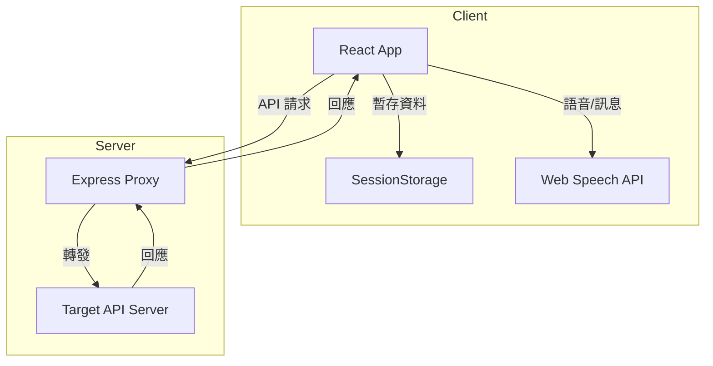
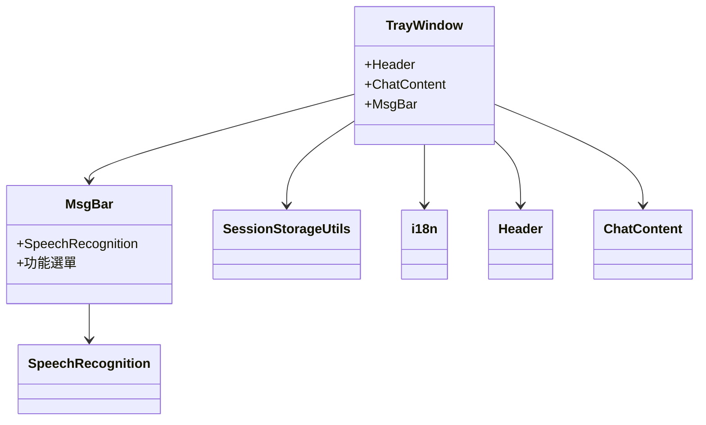

# 技術概念總覽

## 目錄

- 專案簡介
- 整體架構
- 前端技術棧
- 後端技術棧
- 國際化 (i18n)
- 主要功能模組
- 資料流與組件互動
- 樣式與 UI 設計
- 開發與部署流程
- 產品經理視角
- Mermaid 圖表
- 參考檔案

---

## 專案簡介

本專案為一個基於 React 的智能客服前端應用，結合語音辨識、訊息互動、國際化等功能，並以 Express 代理伺服器作為後端 API 轉發。專案結構清晰，易於擴展與維護。

---

## 整體架構

- **前端**：React + TypeScript，組件化設計，支援多語系。
- **後端**：Express 代理伺服器，負責 API 請求轉發。
- **樣式**：SCSS/CSS，支援響應式設計。
- **國際化**：i18next，支援多語言切換。
- **資料儲存**：Session Storage 用於暫存會話資訊。

---

## 前端技術棧

- **React**：主體框架，採用函式型組件與 hooks。
- **TypeScript**：靜態型別檢查，提升開發效率與可維護性。
- **SCSS/CSS**：自訂樣式，分模組管理。
- **i18next**：國際化解決方案。
- **Web Speech API**：語音辨識與語音合成功能。

---

## 後端技術棧

- **Express**：Node.js 框架，作為 API 代理伺服器。
- **Axios**：處理 HTTP 請求。
- **CORS**：跨來源資源共用設定，允許前端存取代理 API。

---

## 國際化 (i18n)

- 語言檔案位於 `src/components/base/i18n/locales`。
- 支援 zh（簡中）、tw（繁中）、en（英文）。
- 語言自動偵測，亦可手動切換。

---

## 主要功能模組

- **TrayWindow**：主視窗組件，整合 Header、ChatContent、MsgBar。
- **MsgBar**：訊息輸入與功能選單。
- **SpeechRecognition**：語音辨識與音量視覺化。
- **SessionStorageUtils**：封裝 sessionStorage 操作。
- **i18n**：國際化初始化與語言資源管理。

---

## 資料流與組件互動

- `TrayWindow` 為主組件，負責組合 Header、ChatContent、MsgBar。
- `MsgBar` 可呼叫 `SpeechRecognition`。
- `SessionStorageUtils` 提供 session 操作工具。

---

## 樣式與 UI 設計

- 樣式集中於 `src/css` 目錄，主要檔案如 `AI_layout_format.css`、`messagebar_1.scss`。
- 採用響應式設計，支援多裝置顯示。
- 圖示與圖片資源集中於 `images` 目錄。

---

## 開發與部署流程

- **開發**：`npm start` 啟動前端，`node server.js` 啟動代理伺服器。
- **測試**：`npm test` 啟動測試。
- **建置**：`npm run build` 產生 production 檔案於 `build`。
- **部署**：將 `build` 內容部署至靜態伺服器，後端代理可獨立運行。

---

## 產品經理視角

- **多語系支援**：可快速擴充新語言。
- **語音互動**：提升用戶體驗，支援語音輸入與播放。
- **模組化設計**：功能可獨立開發與維護。
- **UI/UX**：響應式設計，適用於桌面與行動裝置。
- **API 代理**：可靈活串接後端服務，便於跨域與安全控管。

---

## Mermaid 圖表

### 系統架構圖

### 前端組件結構

---

## 參考檔案

- `src/index.tsx`
- `src/components/traywindow/TrayWindow.tsx`
- `src/components/traywindow/messagebar_new/MsgBar.tsx`
- `src/components/traywindow/messagebar_1/SpeechRecognition.tsx`
- `src/components/base/i18n/i18n.tsx`
- `src/components/base/utils/SessionStorageUtils.tsx`
- `src/css/AI_layout_format.css`
- `src/css/messagebar_1.scss`
- `server.js`
- `package.json`

---

如需更詳細的技術細節，請參閱上述檔案。
